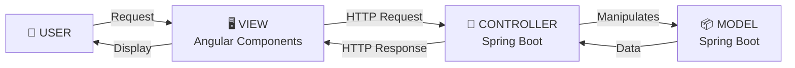
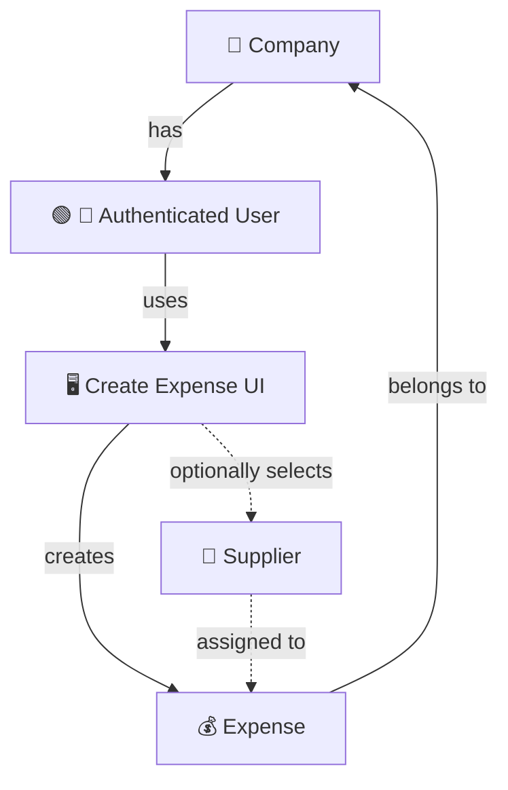
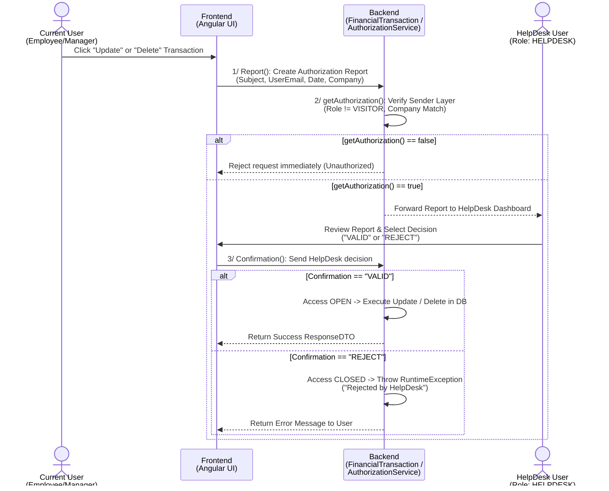

# Inventory
Inventory Management System built with Spring Boot and Angular

### DTO & Mapper Workflow

```mermaid
flowchart LR
    A["🌐 Client / Frontend"] -->|"HTTP Request"| B["📥 DTO"]

    B --> C{"🔍 Request Type"}

    C -->|"Create"| D["🆕 Create DTO"]
    C -->|"Update"| E["✏️ Update DTO"]

    D --> F["🔄 Mapper"]
    E --> G["🔄 Update Mapper"]

    F --> H["🧱 New Entity"]

    G --> I{"⚙️ Field Value"}

    I -->|"Value provided"| J["✅ Update Field"]
    I -->|"null"| K["🛡️ Keep Existing Value"]

    J --> L["🧱 Existing Entity"]
    K --> L

    H --> M["💾 Database"]
    L --> M

    M --> N["📦 Response DTO"]
    N --> O["🌐 Client"]

    classDef client fill:#2563eb,color:#fff,stroke:#1d4ed8,stroke-width:2px
    classDef dto fill:#7c3aed,color:#fff,stroke:#6d28d9,stroke-width:2px
    classDef mapper fill:#0891b2,color:#fff,stroke:#0e7490,stroke-width:2px
    classDef entity fill:#059669,color:#fff,stroke:#047857,stroke-width:2px
    classDef database fill:#f59e0b,color:#fff,stroke:#d97706,stroke-width:2px
    classDef protection fill:#dc2626,color:#fff,stroke:#b91c1c,stroke-width:2px
    classDef decision fill:#f3f4f6,color:#111827,stroke:#6b7280,stroke-width:2px

    class A,O client
    class B,D,E,N dto
    class F,G mapper
    class H,L,J entity
    class M database
    class K protection
    class C,I decision
```

#### 🛡️ Safe DTO-Based Updates

The application uses DTOs (Data Transfer Objects) to control the data exchanged between the client and the backend, avoiding direct exposure of the entities.

For update operations, the Update DTO contains only the fields that the client wants to modify. The mapper then transfers these values to the existing entity.

One of the main challenges is preventing null values from unintentionally overwriting existing data. To solve this, the update mapper uses if conditions to validate each DTO field before applying the change:

DTO field ≠ null → update the corresponding entity field.

DTO field = null → keep the existing entity value unchanged.

This approach makes partial updates safe, predictable, and resistant to accidental data loss.
    
<br></br>
### MVC Architecture — Angular & Spring Boot


The application follows an MVC architecture with Angular Components as the View and Spring Boot handling the Controller and Model layers. This separation of concerns promotes clean, maintainable, testable, and scalable code, while keeping the frontend and backend responsibilities clearly defined.

<br>
</br>

## Security & Company Isolation

The Inventory ERP is designed as a **multi-company system**, so users must only access data belonging to their own company.

For sensitive operations such as listing, viewing, updating, or deleting Expenses, we first identify the **currently authenticated user** through Spring Security and obtain their **Company**. The Company ID is then used to restrict database queries to that company's data. This prevents users from accessing data belonging to another company.

### Expense Flow


## Expense & Supplier Relationship

- Supplier is **optional** for an Expense.
- A Supplier can be **Global** or **Company-specific**.
- A **Global Supplier** is not associated with any Company in the platform (`company = null`).
- A **Company-specific Supplier** belongs to a Company registered in the platform.
- If no supplier is selected, the Expense is saved without a supplier.
- If a supplier is selected, the backend checks if it exists using `findById()`.
- If the supplier exists, it is assigned to the Expense.
- If the supplier doesn't exist, an exception is thrown and the Expense is not saved.

## Supplier Types

```text
                    Supplier
                       │
             ┌─────────┴─────────┐
             ↓                   ↓
          GLOBAL              SPECIFIC
       company = null       company = Company
             │                   │
             ↓                   ↓
   No company associated     Company exists
   with the platform         in the platform

```

# Financial Transaction

I decided to use an authorization workflow for Financial Transactions because I don't want the application to directly assume that a user is allowed to update a transaction.

The idea is simple: **the user sends a request, the system checks authorization, and the authorization service returns a decision.**

## 🔐 Update Workflow

```text
User
 ↓
Update Transaction Request
 ↓
Find Transaction
 ↓
Get Authenticated User
 ↓
Send Authorization Request
 ↓
Authorization Response
 ↓
 ┌──────────────┐
 │              │
 TRUE          FALSE
 │              │
 ↓              ↓
Update         Reject
Transaction    Request
 ↓
Save
 ↓
ResponseDTO
```

## Authorization

The authorization request contains:

```java
AuthorizationRequest request = new AuthorizationRequest(
        currentUser.getId(),
        finance.getId(),
        "UPDATE"
);
```

The authorization service returns a decision:

```java
AuthorizationResponse response =
        authorizationService.checkAuthorization(request);

return response.isAuthorized();
```

So the application does not decide authorization by itself. It **asks the authorization system and uses its response**.

## Update Method

```java
@Override
public FinancialTransactionResponseDTO updateFinancialTransaction(
        Long id,
        FinancialTransactionUpdateDTO dto) {

    FinancialTransaction existing =
            financialTransactionRepository.findById(id)
                    .orElseThrow(() ->
                            new RuntimeException(
                                    "Financial transaction not found with id: " + id
                            ));

    User currentUser = getAuthenticatedUser();

    if (!getAuthorized(currentUser, existing)) {
        throw new RuntimeException(
                "This user is not authorized to update this financial transaction"
        );
    }

    financialTransactionMapper.updateEntity(existing, dto);

    FinancialTransaction updated =
            financialTransactionRepository.save(existing);

    return financialTransactionMapper.toResponseDTO(updated);
}
```

## Main Idea

The responsibilities are separated:

* **Spring Security** → identifies the authenticated user.
* **Authorization Service** → returns `true` or `false`.
* **Financial Transaction Service** → performs the update only when authorized.
* **Mapper** → converts between DTOs and entities.

The important rule is:

> **The client requests an action; the backend asks for an authorization decision; only an authorized request is executed.**

## Changing Workflow for Authorization

I previously implemented a simpler authorization approach for Financial Transactions, but after reviewing the workflow, I decided to improve it by introducing a **HelpDesk-based approval process**. The new approach separates the authorization into clear stages: the user first submits an authorization report, the backend verifies that the request is valid and belongs to the correct company, and then the request is sent to a HelpDesk user for a final decision. Only after receiving a **`VALID`** confirmation can the requested update or deletion be executed. If the request is **`REJECT`** or fails the initial verification, the operation is stopped. This change makes the authorization process more controlled, traceable, and easier to extend while keeping the responsibility for the final decision outside the transaction operation itself.

### Financial Transaction Authorization Flow (UML Sequence Diagram)
 

 
