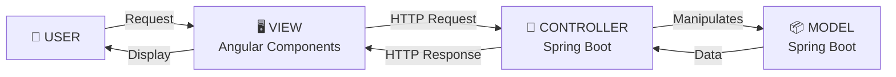

# Inventory
Inventory Management System built with Spring Boot and Angular

### DTO & Mapper Workflow

```mermaid
flowchart LR
    A["🌐 Client / Frontend"] -->|"HTTP Request"| B["📥 DTO"]

    B --> C{"🔍 Request Type"}

    C -->|"Create"| D["🆕 Create DTO"]
    C -->|"Update"| E["✏️ Update DTO"]

    D --> F["🔄 Mapper"]
    E --> G["🔄 Update Mapper"]

    F --> H["🧱 New Entity"]

    G --> I{"⚙️ Field Value"}

    I -->|"Value provided"| J["✅ Update Field"]
    I -->|"null"| K["🛡️ Keep Existing Value"]

    J --> L["🧱 Existing Entity"]
    K --> L

    H --> M["💾 Database"]
    L --> M

    M --> N["📦 Response DTO"]
    N --> O["🌐 Client"]

    classDef client fill:#2563eb,color:#fff,stroke:#1d4ed8,stroke-width:2px
    classDef dto fill:#7c3aed,color:#fff,stroke:#6d28d9,stroke-width:2px
    classDef mapper fill:#0891b2,color:#fff,stroke:#0e7490,stroke-width:2px
    classDef entity fill:#059669,color:#fff,stroke:#047857,stroke-width:2px
    classDef database fill:#f59e0b,color:#fff,stroke:#d97706,stroke-width:2px
    classDef protection fill:#dc2626,color:#fff,stroke:#b91c1c,stroke-width:2px
    classDef decision fill:#f3f4f6,color:#111827,stroke:#6b7280,stroke-width:2px

    class A,O client
    class B,D,E,N dto
    class F,G mapper
    class H,L,J entity
    class M database
    class K protection
    class C,I decision
```

#### 🛡️ Safe DTO-Based Updates

The application uses DTOs (Data Transfer Objects) to control the data exchanged between the client and the backend, avoiding direct exposure of the entities.

For update operations, the Update DTO contains only the fields that the client wants to modify. The mapper then transfers these values to the existing entity.

One of the main challenges is preventing null values from unintentionally overwriting existing data. To solve this, the update mapper uses if conditions to validate each DTO field before applying the change:

DTO field ≠ null → update the corresponding entity field.

DTO field = null → keep the existing entity value unchanged.

This approach makes partial updates safe, predictable, and resistant to accidental data loss.
    
<br></br>
### MVC Architecture — Angular & Spring Boot


The application follows an MVC architecture with Angular Components as the View and Spring Boot handling the Controller and Model layers. This separation of concerns promotes clean, maintainable, testable, and scalable code, while keeping the frontend and backend responsibilities clearly defined.

<br>
</be>

## Security & Company Isolation

#### Changes

* Added Spring Security.
* Added `UserRepository.findByEmail()`.
* Added authenticated user detection.
* Added company-based Expense filtering.
* Updated Expense CRUD operations to respect company isolation.

#### Expense Repository

```java
Optional<Expense> findByIdAndCompanyId(Long id, Long companyId);
List<Expense> findByCompanyId(Long companyId);
```

#### Dependency

```xml
<dependency>
    <groupId>org.springframework.boot</groupId>
    <artifactId>spring-boot-starter-security</artifactId>
</dependency>
```

#### Status

* ✅ Spring Security
* ✅ Authenticated User
* ✅ Company Isolation
* ⬜ JWT
* ⬜ Authorization
  
## Expense & Supplier Relationship

- Supplier is **optional** for an Expense.
- A Supplier can be **Global** or **Company-specific**.
- A **Global Supplier** is not associated with any Company in the platform (`company = null`).
- A **Company-specific Supplier** belongs to a Company registered in the platform.
- If no supplier is selected, the Expense is saved without a supplier.
- If a supplier is selected, the backend checks if it exists using `findById()`.
- If the supplier exists, it is assigned to the Expense.
- If the supplier doesn't exist, an exception is thrown and the Expense is not saved.

## Supplier Types

```text
                    Supplier
                       │
             ┌─────────┴─────────┐
             ↓                   ↓
          GLOBAL              SPECIFIC
       company = null       company = Company
             │                   │
             ↓                   ↓
   No company associated     Company exists
   with the platform         in the platform

```
