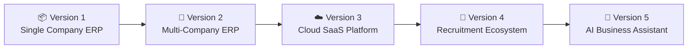
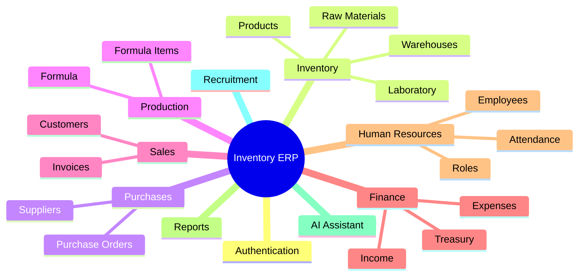
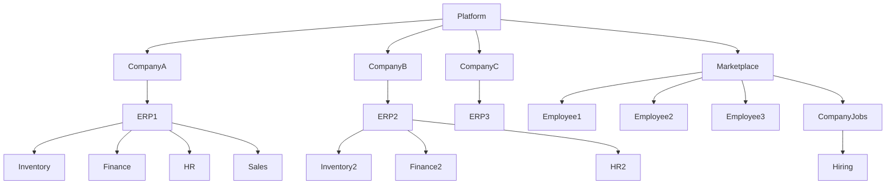
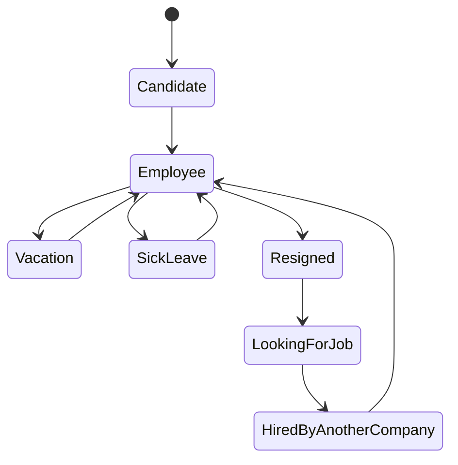
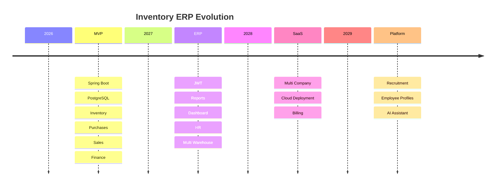

# 🚀 Inventory ERP Roadmap

> **Vision**
>
> Build a modern ERP platform that starts as an inventory management system for a single company and evolves into a cloud-native multi-company SaaS ecosystem with AI assistance and an integrated recruitment platform.

---

## Product Evolution

---

## Modules

---

## Long-Term Architecture

---

## Employee Lifecycle

---

## Development Timeline

