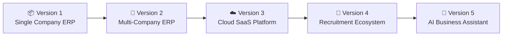
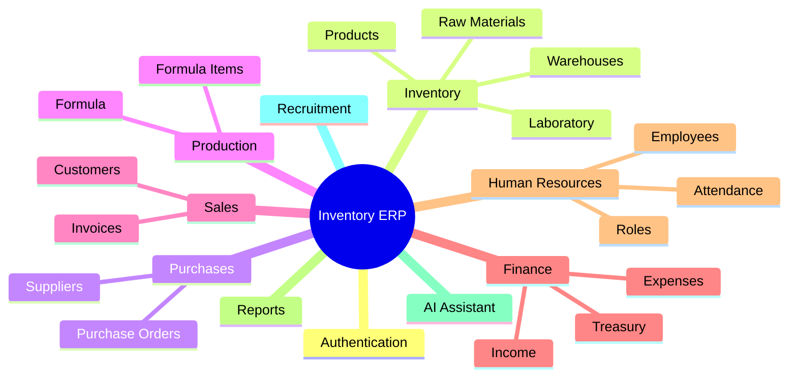
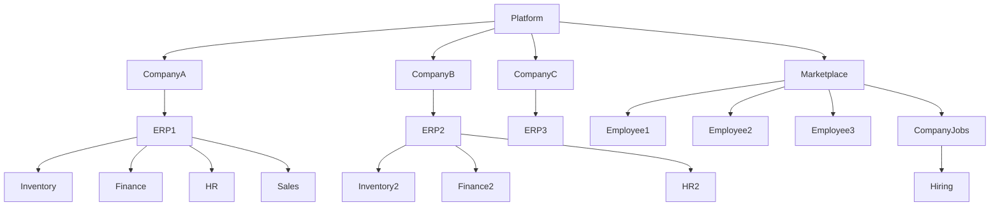
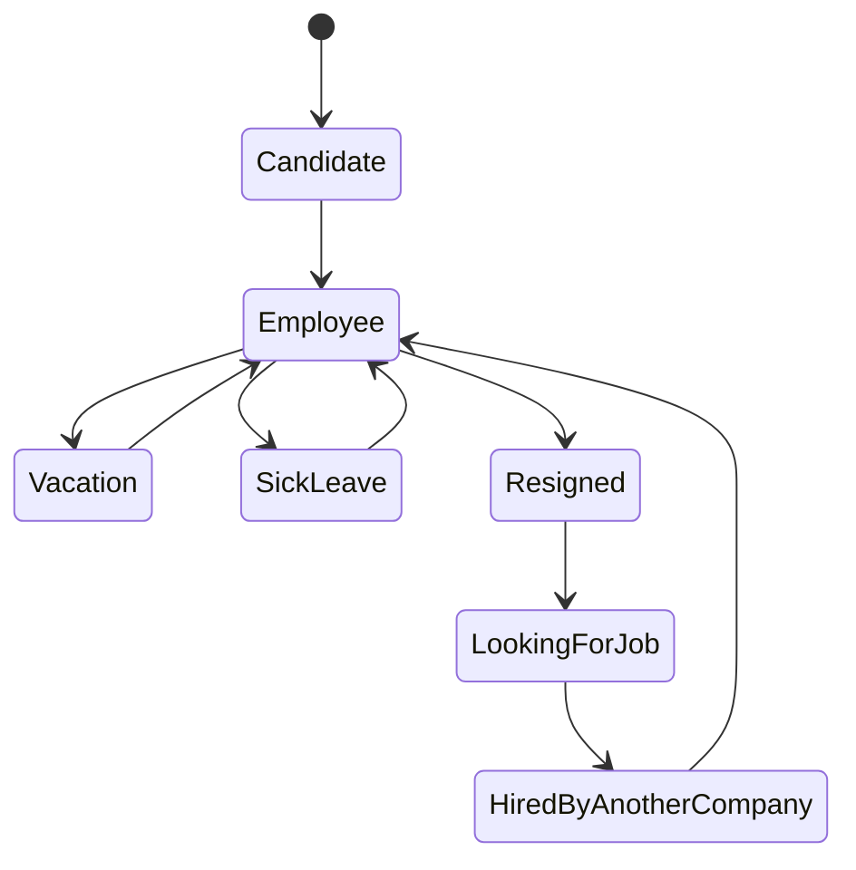
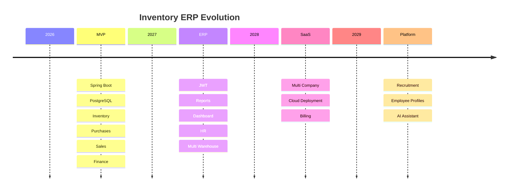

# 🚀 Inventory ERP Roadmap

> **Vision**
>
> Build a modern ERP platform that starts as an inventory management system for a single company and evolves into a cloud-native multi-company SaaS ecosystem with AI assistance and an integrated recruitment platform.

---

## Product Evolution



---

## Modules



---

## Long-Term Architecture



---

## Employee Lifecycle



---

## Development Timeline


## 🔮 Future Features

### Audit & Activity Tracking

To improve traceability and security, the platform will include a complete auditing system.

#### Planned Features

- Automatically record the creation and last modification date of every entity (`createdAt`, `updatedAt`).
- Track the user responsible for each operation (`createdBy`, `updatedBy`).
- Maintain a complete audit history of all critical changes.
- Allow administrators to view who modified a record, what was changed, and when.
- Support activity logs for security investigations and compliance.
- Display the latest activity directly from the user profile.
- Generate audit reports for management and administrators.

### Example

```
User: Ahmed

Created:
18/07/2026 10:35

Last Updated:
02/08/2026 16:12

Updated By:
Administrator

History:
• Email updated
• Role changed from SALES to MANAGER
• Status changed to ON_LEAVE
```

> **Goal:** Provide enterprise-level traceability, improve security, and ensure accountability for every important action performed within the ERP.
### Professional Profile & Recruitment

The platform will evolve beyond a traditional ERP by allowing employees to maintain a persistent professional profile across companies.

#### Planned Features

- Persistent employee profile.
- Employment history across multiple companies.
- Skills, certifications, and education management.
- Professional portfolio.
- Internal recruitment marketplace.
- AI-powered candidate matching.
- LinkedIn profile integration (if supported by available APIs and user consent).
- Secure transfer of professional profiles between companies while preserving data ownership and privacy.

## 🚀 Roadmap(first virsion)

### 🟢 Phase 1 — Project Setup
✔ Spring Boot
✔ Maven
✔ Git
✔ PostgreSQL

### 🟢 Phase 2 — Entities
✔ User
✔ Company
✔ Supplier
✔ Customer
✔ RawMaterial
✔ Product
✔ Formula
✔ FormulaItem
✔ Purchase
✔ PurchaseItem
✔ Sale
✔ SaleItem
✔ StockMovement
✔ Expense
✔ FinancialTransaction

### 🟢 Phase 3 — DTOs
✔ Create DTOs
✔ Update DTOs
✔ Response DTOs

### 🟢 Phase 4 — Mappers
✔ Entity → DTO
✔ DTO → Entity
✔ Update mapping
✔ Relationship mapping

### 🟢 Phase 5 — Service Layer
✔ Service interfaces
✔ Initial service implementations
✔ Basic CRUD structure
✔ Mapper integration

### 🟢 Phase 6 — Repository
✔ Repository
✔ Custom queries
✔ Search / filtering
✔ Pagination

### 🟢 Phase 7 — Business Logic
✔ Purchasing
✔ Sales
✔ Inventory
✔ Manufacturing
✔ Stock management
✔ Finance

### ⬜ Phase 8 — REST API
□ Controllers
□ CRUD endpoints
□ Validation
□ Exception handling
□ Swagger / OpenAPI

### ⬜ Phase 9 — Security
□ Spring Security
□ JWT
□ Authentication
□ Authorization

### ⬜ Phase 10 — Testing
□ Unit tests
□ Integration tests
□ API tests

### ⬜ Phase 11 — Frontend
□ Angular setup
□ Authentication
□ Dashboard
□ CRUD pages

### ⬜ Phase 12 — Deployment
□ Docker
□ CI/CD
□ Cloud deployment
